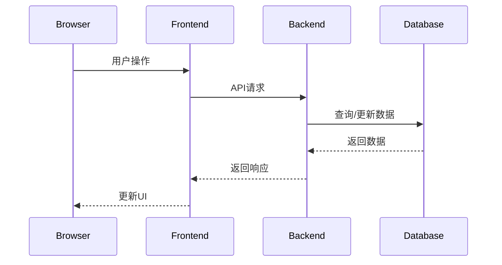
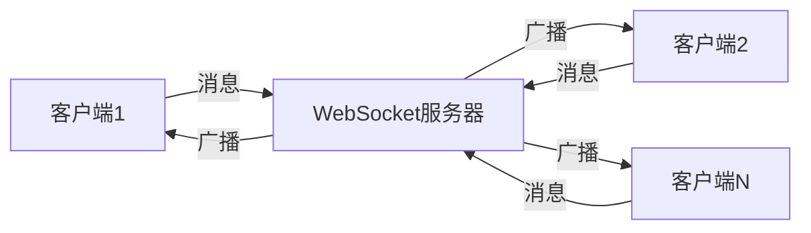

# API 接口设计图

## REST API 结构图

```mermaid
graph TD
    A[API Gateway] --> B[用户管理 /api/user]
    A --> C[商品管理 /api/goods]
    A --> D[信息披露 /api/disclosure]
    A --> E[评论管理 /api/comment]
    A --> F[分类管理 /api/category]
    A --> G[通知管理 /api/notification]
    
    B --> B1[登录 /login]
    B --> B2[注册 /register]
    B --> B3[获取用户信息 /profile]
    B --> B4[更新用户信息 /update]
    
    C --> C1[搜索商品 /search]
    C --> C2[商品详情 /detail]
    C --> C3[添加收藏 /collect]
    C --> C4[取消收藏 /uncollect]
    
    D --> D1[获取信息披露 /list]
    D --> D2[提交信息披露 /submit]
    D --> D3[更新信息披露 /update]
    D --> D4[删除信息披露 /delete]
    
    E --> E1[获取评论 /list]
    E --> E2[提交评论 /post]
    E --> E3[回复评论 /reply]
    E --> E4[删除评论 /delete]
    
    F --> F1[获取分类树 /tree]
    F --> F2[添加分类 /add]
    F --> F3[更新分类 /update]
    
    G --> G1[获取通知 /list]
    G --> G2[标记已读 /markRead]
    G --> G3[删除通知 /delete]
```

## 请求响应流程图

```mermaid
sequenceDiagram
    participant Browser
    participant Frontend
    participant Backend
    participant Database
    
    Browser->>Frontend: 用户操作
    Frontend->>Backend: API请求
    Backend->>Database: 查询/更新数据
    Database-->>Backend: 返回数据
    Backend-->>Frontend: 返回响应
    Frontend-->>Browser: 更新UI
```

## WebSocket 实时通信图

```mermaid
graph LR
    A[客户端1] -- "消息" --> S[WebSocket服务器]
    B[客户端2] -- "消息" --> S
    C[客户端N] -- "消息" --> S
    S -- "广播" --> A
    S -- "广播" --> B
    S -- "广播" --> C
```