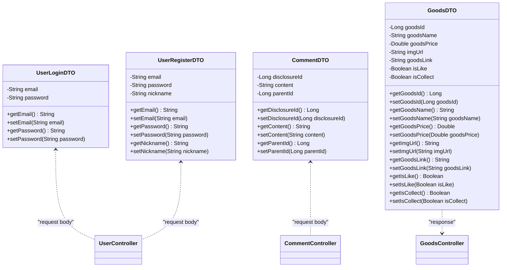

# 项目类图

## 实体层 (Entity Layer)

```mermaid
classDiagram
    class User {
        -Long id
        -String openid
        -String nickname
        -String name
        -String phone
        -String password
        -String avatar
        -Date createTime
        -Integer gender
        -Integer age
        -Date birthDate
        +getId() Long
        +setId(Long id)
        +getOpenid() String
        +setOpenid(String openid)
        +getNickname() String
        +setNickname(String nickname)
        +getName() String
        +setName(String name)
        +getPhone() String
        +setPhone(String phone)
        +getPassword() String
        +setPassword(String password)
        +getAvatar() String
        +setAvatar(String avatar)
        +getCreateTime() Date
        +setCreateTime(Date createTime)
        +getGender() Integer
        +setGender(Integer gender)
        +getAge() Integer
        +setAge(Integer age)
        +getBirthDate() Date
        +setBirthDate(Date birthDate)
    }

    class Goods {
        -Long goodsId
        -String goodsName
        -Integer goodsNumber
        -Double goodsPrice
        -Date createTime
        -Date updateTime
        -Long catId
        -Long author
        -Integer mallType
        -String brand
        -String goodsLink
        -String imgUrl
        -Integer status
        -List~String~ picsUrl
        -Boolean isLike
        -Boolean isCollect
        -Long likeCount
        -Long collectCount
        +getGoodsId() Long
        +setGoodsId(Long goodsId)
        +getGoodsName() String
        +setGoodsName(String goodsName)
        +getGoodsNumber() Integer
        +setGoodsNumber(Integer goodsNumber)
        +getGoodsPrice() Double
        +setGoodsPrice(Double goodsPrice)
        +getCreateTime() Date
        +setCreateTime(Date createTime)
        +getUpdateTime() Date
        +setUpdateTime(Date updateTime)
        +getCatId() Long
        +setCatId(Long catId)
        +getAuthor() Long
        +setAuthor(Long author)
        +getMallType() Integer
        +setMallType(Integer mallType)
        +getBrand() String
        +setBrand(String brand)
        +getGoodsLink() String
        +setGoodsLink(String goodsLink)
        +getImgUrl() String
        +setImgUrl(String imgUrl)
        +getStatus() Integer
        +setStatus(Integer status)
        +getPicsUrl() List~String~
        +setPicsUrl(List~String~ picsUrl)
        +getIsLike() Boolean
        +setIsLike(Boolean isLike)
        +getIsCollect() Boolean
        +setIsCollect(Boolean isCollect)
        +getLikeCount() Long
        +setLikeCount(Long likeCount)
        +getCollectCount() Long
        +setCollectCount(Long collectCount)
    }

    class Disclosure {
        -Long disclosureId
        -Long goodsId
        -Long author
        -Date createTime
        -String content
        -Double disclosurePrice
        -String imgUrl
        -String title
        -String link
        -Integer status
        +getDisclosureId() Long
        +setDisclosureId(Long disclosureId)
        +getGoodsId() Long
        +setGoodsId(Long goodsId)
        +getAuthor() Long
        +setAuthor(Long author)
        +getCreateTime() Date
        +setCreateTime(Date createTime)
        +getContent() String
        +setContent(String content)
        +getDisclosurePrice() Double
        +setDisclosurePrice(Double disclosurePrice)
        +getImgUrl() String
        +setImgUrl(String imgUrl)
        +getTitle() String
        +setTitle(String title)
        +getLink() String
        +setLink(String link)
        +getStatus() Integer
        +setStatus(Integer status)
    }

    class Category {
        -Long catId
        -String catName
        -Long catPid
        -String catIcon
        -Integer catLevel
        +getCatId() Long
        +setCatId(Long catId)
        +getCatName() String
        +setCatName(String catName)
        +getCatPid() Long
        +setCatPid(Long catPid)
        +getCatIcon() String
        +setCatIcon(String catIcon)
        +getCatLevel() Integer
        +setCatLevel(Integer catLevel)
    }

    class Comment {
        -Long commentId
        -Long disclosureId
        -Long userId
        -String content
        -Date createTime
        -Long parentId
        -Integer status
        +getCommentId() Long
        +setCommentId(Long commentId)
        +getDisclosureId() Long
        +setDisclosureId(Long disclosureId)
        +getUserId() Long
        +setUserId(Long userId)
        +getContent() String
        +setContent(String content)
        +getCreateTime() Date
        +setCreateTime(Date createTime)
        +getParentId() Long
        +setParentId(Long parentId)
        +getStatus() Integer
        +setStatus(Integer status)
    }

    class Notification {
        -Long notificationId
        -Long userId
        -String title
        -String content
        -Integer type
        -Date createTime
        -Boolean isRead
        +getNotificationId() Long
        +setNotificationId(Long notificationId)
        +getUserId() Long
        +setUserId(Long userId)
        +getTitle() String
        +setTitle(String title)
        +getContent() String
        +setContent(String content)
        +getType() Integer
        +setType(Integer type)
        +getCreateTime() Date
        +setCreateTime(Date createTime)
        +getIsRead() Boolean
        +setIsRead(Boolean isRead)
    }

    class GoodsLike {
        -Long id
        -Long userId
        -Long goodsId
        -Date createTime
        +getId() Long
        +setId(Long id)
        +getUserId() Long
        +setUserId(Long userId)
        +getGoodsId() Long
        +setGoodsId(Long goodsId)
        +getCreateTime() Date
        +setCreateTime(Date createTime)
    }

    class GoodsCollect {
        -Long id
        -Long userId
        -Long goodsId
        -Date createTime
        +getId() Long
        +setId(Long id)
        +getUserId() Long
        +setUserId(Long userId)
        +getGoodsId() Long
        +setGoodsId(Long goodsId)
        +getCreateTime() Date
        +setCreateTime(Date createTime)
    }

    %% 关系定义
    User ||--o{ Goods : "发布"
    User ||--o{ Disclosure : "发布"
    User ||--o{ Comment : "发表"
    User ||--o{ Notification : "接收"
    User ||--o{ GoodsLike : "点赞"
    User ||--o{ GoodsCollect : "收藏"
    
    Goods }|--|| Category : "属于"
    Goods ||--o{ Disclosure : "关联"
    Goods ||--o{ GoodsLike : "被点赞"
    Goods ||--o{ GoodsCollect : "被收藏"
    
    Disclosure ||--o{ Comment : "评论"
    Disclosure }|--|| Goods : "关联"
    
    Comment ||--o{ Comment : "回复"
    
    Notification }|--|| User : "发送给"
```

## 服务层 (Service Layer)

```mermaid
classDiagram
    class UserService {
        +User login(String email, String password)
        +User register(User user)
        +User getUserById(Long id)
        +User updateUserInfo(Long id, User user)
        +void deleteUser(Long id)
    }

    class GoodsService {
        +List~Goods~ getAllGoods()
        +Goods getGoodsById(Long id)
        +List~Goods~ searchGoods(String keyword)
        +Goods createGoods(Goods goods)
        +Goods updateGoods(Long id, Goods goods)
        +void deleteGoods(Long id)
        +void toggleLike(Long userId, Long goodsId)
        +void toggleCollect(Long userId, Long goodsId)
    }

    class DisclosureService {
        +List~Disclosure~ getAllDisclosures()
        +Disclosure getDisclosureById(Long id)
        +List~Disclosure~ getDisclosuresByUserId(Long userId)
        +Disclosure createDisclosure(Disclosure disclosure)
        +Disclosure updateDisclosure(Long id, Disclosure disclosure)
        +void deleteDisclosure(Long id)
    }

    class CommentService {
        +List~Comment~ getCommentsByDisclosureId(Long disclosureId)
        +Comment addComment(Comment comment)
        +Comment updateComment(Long id, Comment comment)
        +void deleteComment(Long id)
    }

    class CategoryService {
        +List~Category~ getAllCategories()
        +Category getCategoryById(Long id)
        +Category createCategory(Category category)
        +Category updateCategory(Long id, Category category)
        +void deleteCategory(Long id)
    }

    class NotificationService {
        +List~Notification~ getNotificationsByUserId(Long userId)
        +Notification createNotification(Notification notification)
        +void markAsRead(Long notificationId)
        +void deleteNotification(Long id)
    }

    UserService ||..|> ServiceInterface : implements
    GoodsService ||..|> ServiceInterface : implements
    DisclosureService ||..|> ServiceInterface : implements
    CommentService ||..|> ServiceInterface : implements
    CategoryService ||..|> ServiceInterface : implements
    NotificationService ||..|> ServiceInterface : implements
```

## 控制器层 (Controller Layer)

```mermaid
classDiagram
    class UserController {
        +Result~Object~ login(@RequestBody UserLoginDTO loginDTO)
        +Result~Object~ register(@RequestBody UserRegisterDTO registerDTO)
        +Result~Object~ getCurrentUser(LoginUser loginUser)
        +Result~Object~ updateProfile(@RequestBody User user, LoginUser loginUser)
    }

    class GoodsController {
        +Result~Object~ getGoodsList()
        +Result~Object~ getGoodsDetail(Long id)
        +Result~Object~ searchGoods(String keyword)
        +Result~Object~ createGoods(@RequestBody Goods goods, LoginUser loginUser)
        +Result~Object~ toggleLike(Long goodsId, LoginUser loginUser)
        +Result~Object~ toggleCollect(Long goodsId, LoginUser loginUser)
    }

    class DisclosureController {
        +Result~Object~ getDisclosureList()
        +Result~Object~ getDisclosureById(Long id)
        +Result~Object~ createDisclosure(@RequestBody Disclosure disclosure, LoginUser loginUser)
        +Result~Object~ updateDisclosure(Long id, @RequestBody Disclosure disclosure, LoginUser loginUser)
    }

    class CommentController {
        +Result~Object~ getComments(Long disclosureId)
        +Result~Object~ addComment(@RequestBody CommentDTO commentDTO, LoginUser loginUser)
    }

    class CategoryController {
        +Result~Object~ getCategoryTree()
        +Result~Object~ getCategoryList()
    }

    UserController ||..|> BaseController : extends
    GoodsController ||..|> BaseController : extends
    DisclosureController ||..|> BaseController : extends
    CommentController ||..|> BaseController : extends
    CategoryController ||..|> BaseController : extends
```

## DTO与VO层

