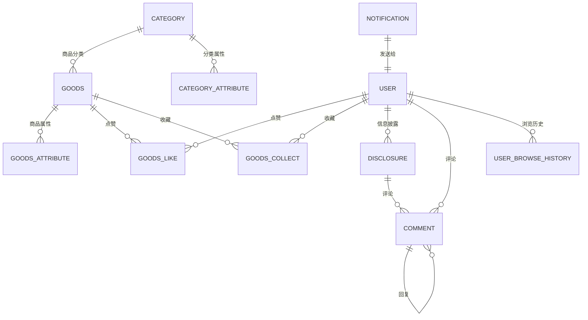

# 数据库设计图

## 实体关系图 (ERD)

## 数据表结构

### 用户表 (User)
- id: 主键
- nickname: 昵称
- email: 邮箱
- password: 密码
- avatar: 头像
- createTime: 创建时间

### 商品表 (Goods)
- id: 主键
- name: 商品名
- price: 价格
- platform: 平台
- url: 商品链接
- imageUrl: 图片链接
- categoryId: 分类ID

### 信息披露表 (Disclosure)
- id: 主键
- userId: 用户ID
- title: 标题
- content: 内容
- status: 状态
- createTime: 创建时间

### 分类表 (Category)
- id: 主键
- name: 分类名
- parentId: 父分类ID
- level: 层级