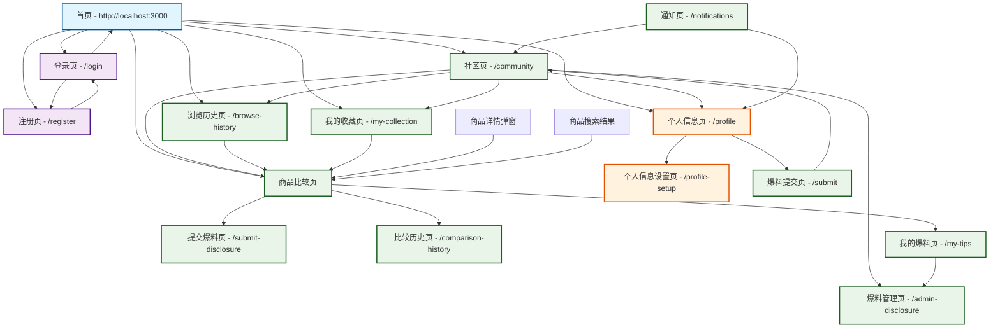

# 页面流转图



# 详细页面流转说明

## 1. 首页 (Home Page - /)
- **功能**: 网站入口，展示热门商品、推荐内容
- **导航选项**:
  - 登录 (/login)
  - 注册 (/register)
  - 社区 (/community)
  - 商品比较 (/compare)
  - 个人中心 (/profile)

## 2. 认证流程
### 2.1 登录页 (/login)
- **功能**: 用户身份验证
- **后续操作**:
  - 登录成功 → 首页或其他受保护页面
  - 跳转注册 → /register
  - 忘记密码 → /reset-password (如适用)

### 2.2 注册页 (/register)
- **功能**: 新用户注册
- **后续操作**:
  - 注册成功 → 自动登录并跳转首页
  - 已有账户 → /login

## 3. 社区功能
### 3.1 社区页 (/community)
- **功能**: 展示用户爆料、讨论内容
- **导航选项**:
  - 提交爆料 → /submit-disclosure
  - 浏览历史 → /browse-history
  - 我的收藏 → /my-collection
  - 个人资料 → /profile
  - 爆料管理 → /admin-disclosure (管理员)

### 3.2 提交爆料页 (/submit-disclosure)
- **功能**: 用户提交商品爆料信息
- **返回路径**:
  - 提交成功 → /community
  - 取消 → /community

### 3.3 爆料管理页 (/admin-disclosure)
- **功能**: 管理员审核爆料内容
- **关联页面**: /community

## 4. 商品比较功能
### 4.1 商品比较页 (/compare)
- **功能**: 对比不同商品的价格、特性
- **子功能页面**:
  - 比较历史 → /comparison-history
  - 我的爆料 → /my-tips
  - 提交爆料 → /submit-disclosure

### 4.2 比较历史页 (/comparison-history)
- **功能**: 查看历史比较记录
- **返回路径** → /compare

## 5. 个人功能
### 5.1 个人信息页 (/profile)
- **功能**: 查看和编辑个人资料
- **关联页面**:
  - 个人资料设置 → /profile-setup
  - 浏览历史 → /browse-history
  - 我的收藏 → /my-collection
  - 我的爆料 → /my-tips
  - 通知 → /notifications

### 5.2 个人资料设置页 (/profile-setup)
- **功能**: 设置和完善个人信息
- **返回路径** → /profile

### 5.3 浏览历史页 (/browse-history)
- **功能**: 查看商品浏览记录
- **关联页面** → /compare

### 5.4 我的收藏页 (/my-collection)
- **功能**: 管理收藏的商品
- **关联页面** → /compare

### 5.5 我的爆料页 (/my-tips)
- **功能**: 查看自己提交的爆料
- **关联页面**: /community, /admin-disclosure

## 6. 通用功能
### 6.1 通知页 (/notifications)
- **功能**: 查看系统和个人通知
- **返回路径**: 任意页面

### 6.2 商品详情弹窗
- **功能**: 展示商品详细信息
- **关联页面**: 从任意页面可弹出

## 7. 交互流程
### 7.1 用户登录流程
```
首页 → 登录页 → 验证 → 首页/个人中心
```

### 7.2 商品比较流程
```
首页 → 商品比较页 → 选择商品 → 对比结果 → (可保存/分享)
```

### 7.3 爆料提交流程
```
社区页 → 提交爆料页 → 填写信息 → 提交 → 等待审核 → 发布/驳回
```

### 7.4 个人中心流程
```
首页 → 个人中心 → 查看资料/历史/收藏 → 设置/编辑 → 保存
```

## 8. 移动端适配
- 所有页面均支持移动端响应式布局
- 导航菜单在移动端以汉堡菜单形式呈现
- 触摸友好的按钮和交互元素