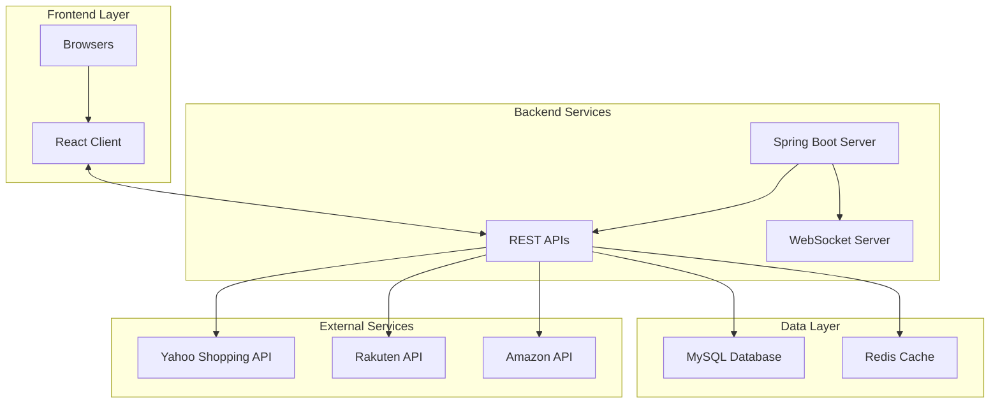
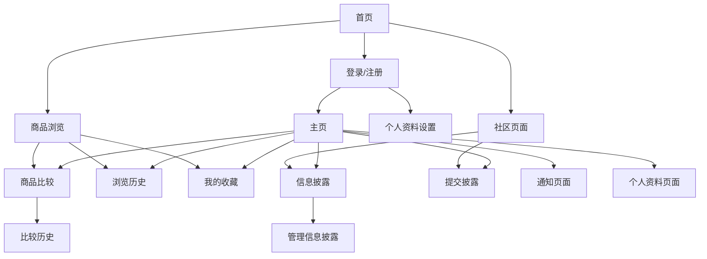
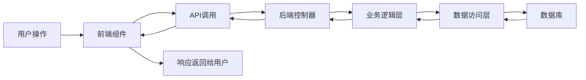
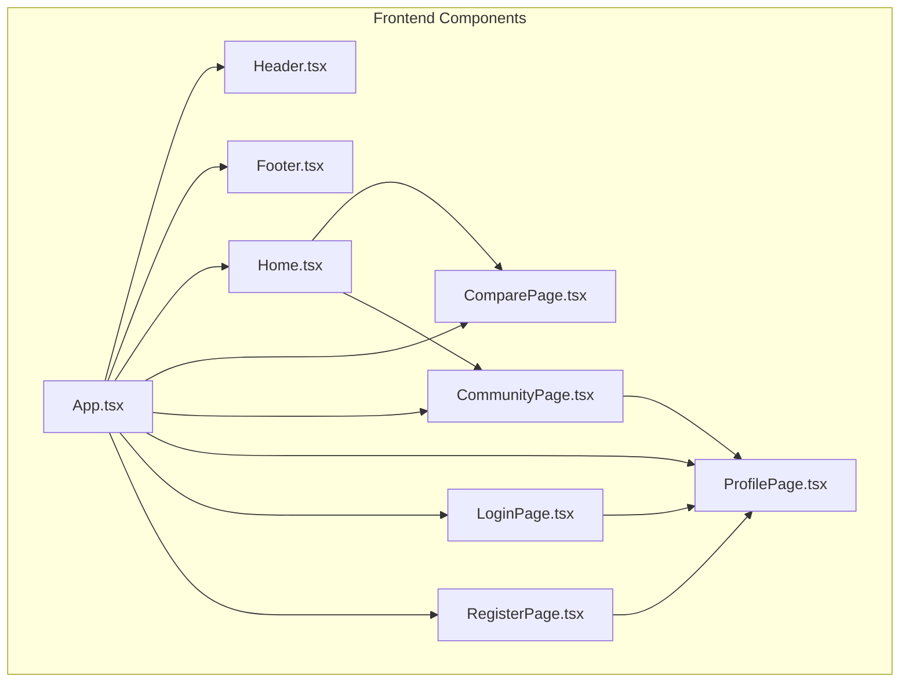

# 系统架构图

```mermaid
graph TB
    subgraph "Frontend Layer"
        A[React Client]
        B[Browsers]
    end
    
    subgraph "Backend Services"
        C[Spring Boot Server]
        D[REST APIs]
        E[WebSocket Server]
    end
    
    subgraph "Data Layer"
        F[MySQL Database]
        G[Redis Cache]
    end
    
    subgraph "External Services"
        H[Yahoo Shopping API]
        I[Rakuten API]
        J[Amazon API]
    end
    
    A <--> D
    B --> A
    C --> D
    D --> F
    D --> G
    C --> E
    D --> H
    D --> I
    D --> J
```

# 页面流转图

```mermaid
graph TD
    A[首页] --> B[登录/注册]
    A --> C[商品浏览]
    A --> D[社区页面]
    
    B --> E[个人资料设置]
    B --> F[主页]
    
    C --> G[商品比较]
    C --> H[浏览历史]
    C --> I[我的收藏]
    
    D --> J[信息披露]
    D --> K[提交披露]
    
    F --> G
    F --> H
    F --> I
    F --> J
    F --> K
    F --> L[通知页面]
    F --> M[个人资料页面]
    
    G --> N[比较历史]
    
    J --> O[管理信息披露]
```

# 数据流图

```mermaid
graph LR
    A[用户操作] --> B[前端组件]
    B --> C[API调用]
    C --> D[后端控制器]
    D --> E[业务逻辑层]
    E --> F[数据访问层]
    F --> G[数据库]
    G --> F
    F --> E
    E --> D
    D --> C
    C --> B
    B --> H[响应返回给用户]
```

# 组件关系图

```mermaid
graph TB
    subgraph "Frontend Components"
        A[App.tsx]
        B[Header.tsx]
        C[Footer.tsx]
        D[Home.tsx]
        E[ComparePage.tsx]
        F[CommunityPage.tsx]
        G[ProfilePage.tsx]
        H[LoginPage.tsx]
        I[RegisterPage.tsx]
    end
    
    A --> B
    A --> C
    A --> D
    A --> E
    A --> F
    A --> G
    A --> H
    A --> I
    
    D --> E
    D --> F
    F --> G
    H --> G
    I --> G
```